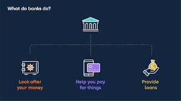

MarkDown [CheatSheet](https://www.markdownguide.org/basic-syntax/#links)

# Financial Training - Financial Markets

## 4 Bank Types
### Central Banks 
- Manage the money supply in a single country. Set Monetary policy goals
- E.g US Federal Reserve or Europe Central Bank
### Retail Banks
- Offer public finanical products and services
- E.g Bank Accounts and loans
### Universal Banks
- Provide a wider variety of financial services.
E.g Commerical banking and Investment services
### Investment Banks
- A finacial Intermediary that perform a variety of services.
- E.g specialist in large and complex financial transactions and acting as a broker or advisor for institutional clients

## What is a bank?
A bank is a financial institution that accepts money deposits and loan money to borrowers.

### Fractional Reserve

Banks only keep a fraction of the money deposited in the reserve while investing the rest into the money markets.

## Interest Rates

- Interest: A fee for the use of money
- Interest rate: A percentage of the loan or deposit that is charged as interest
- APR: Annual percentage of rate of interest

## Banks - Monetary Policy
Retail banks can set their own rate for lending money to their clients. But the rate to lend between banks is set by the Central bank

- **LIBOR**: London Interbank Offered Rate was a benchmark interest rate for short-term loans between banks. But it has been abolished and been replaced by **Secured Overnight Financing Rate (SOFR)**

## Central Banks - Interest and Inflation
 **Interest Rates**: The percentage of principal charged by the lender for the use of its money.
 **Inflation**: A quantitative measure of how much the average price for selected goods and services will rise over time. Shows a decrease in the purchasing power of a nation's currency. Measured by CPI and PPI.
 - CPI: Consumer price Index
 - PPI: Producer Price Index
 The central bank can make changes to affect the inflation rate.
 - Increase Inflation = More Spending + Lower Interest Rates
 - Decrease Inflation = Less Spending + Increase Interest Rate

### Impact of higher interest rates
High interest rates = higher exchange rates (more demand for the currency aborad), to help reduce inflationary pressure by:
- Making Imports cheaper(lower price of imported goods)
- Reduce demand for export and increase incentive to cut cost for export.

## Quantitative Easing (QE)
New money is created electronically and is used to purchase Goverment Bonds or other assets. Increased bond prices, reduce yield and encourages money to be invested elsewhere e.g borrowing.
- More money supply = lower cost of borrowing
- Used when inflation and interest are very low and need boosting through spending.

## Corporate Banking
### Multi-Bank Syndicated Loans
- Larger loans supported by group of banks to mitigate the risk and raise the money for the loan.
### Foreign Exchange Facilities
- Provide facilities and services such as: balance sheet analysis , hedging solutions and managing exposure and rise to FX movements.
### Cash Management Services
- Moving large amount of money between various accounts
### Letters of Credit and Gurantess
- Assurance from the bank that the exporter will be paid after shipping goods.
### Lines of Credit
- Overdraft in Business form, won't display negative balance on the account. Instead, the line of credit set up on a seperate account.

## Services of Investment Banking
### Research and Advisory
Provide free services to gain the good will of their clients and encourage to use other services.
- Buy/Sell/Hold Recommendations: What stocks to buy and when to sell.
- Financial Trends and Forecasting: What's the current trend for a stock and forecast.
- Politics and Macro Economics: How a stock is affected by major events.
- Market Analysis: Analysis of the market via risk models and techical knowledge.

